+++
title = "2023 summary"
date = 2023-12-31

[extra]
unlisted = true
enableSampleImage = false
+++

I spent a large portion of this year digging deeper into graphics programming concepts.

- sdf-editor

## January

A the start of the year I was working on the sdf-editor and not a ton of context was saved because I didn't have this website and I wanted the results to be a surprise. This was a huge mistake, I need to get better at showing progress externally.

[parse tree w/ grouping](https://discord.com/channels/354027975412416523/354027975412416524/1069771189226057759)

<div class="center-align vmargin-1em">
  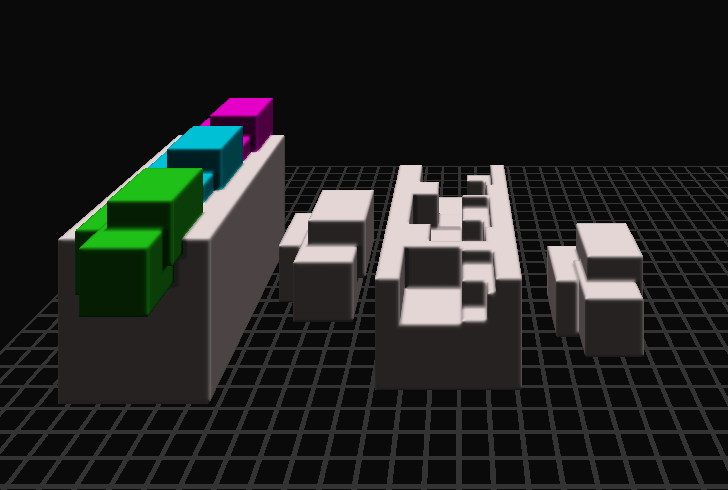
</div>

<div class="center-align vmargin-1em">
  
</div>

- more register based musings

<div class="center-align vmargin-1em">
  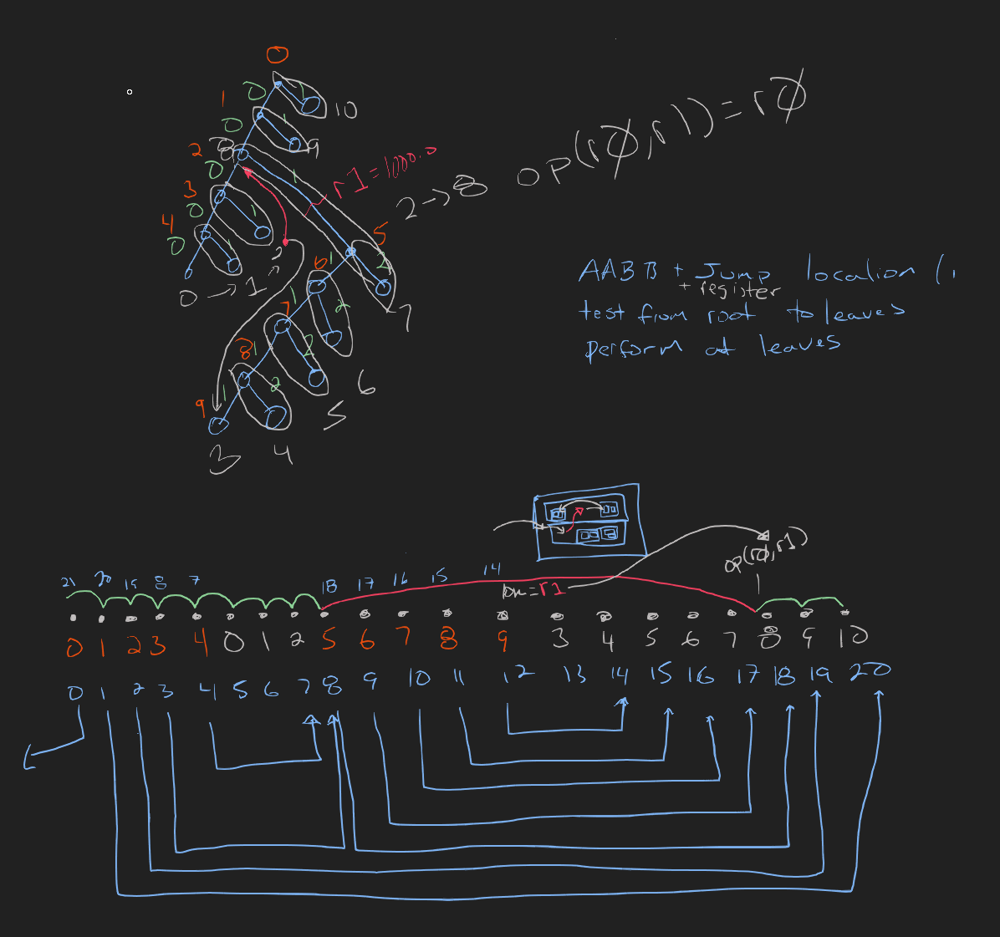
</div>

Suffered from a simple [change](https://discord.com/channels/354027975412416523/354027975412416524/1073131427874488330) (adding a couple properties) that ballooned into larger refactor. The problem was that there is no easy way to find all of the places a property needs to be referenced or copied. This refactor moved me towards using non-optional `switch()` statements that force every `enum` to be present. This adds more code, but atleast adding a propery that needs to be plumbed through the system will cause compile time errors instead of having to find all of the issues at runtime.

## Februrary

I needed a distration and happened to watch a Pezza's work video [Writing a Physics Engine from scratch - collision detection optimization](https://www.youtube.com/watch?v=9IULfQH7E90) where they show a very large number of particles interacting. I got nerd sniped!

<div class="center-align vmargin-1em">
  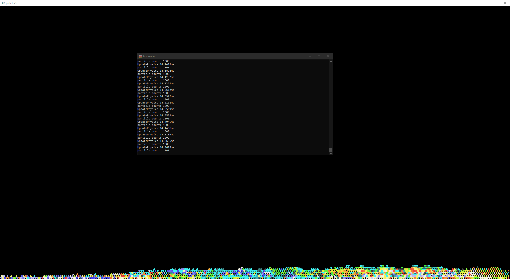
  <br />
  <code><pre>~14ms for 1300 particles, ew!</pre></code>
</div>

<div class="center-align vmargin-1em">
  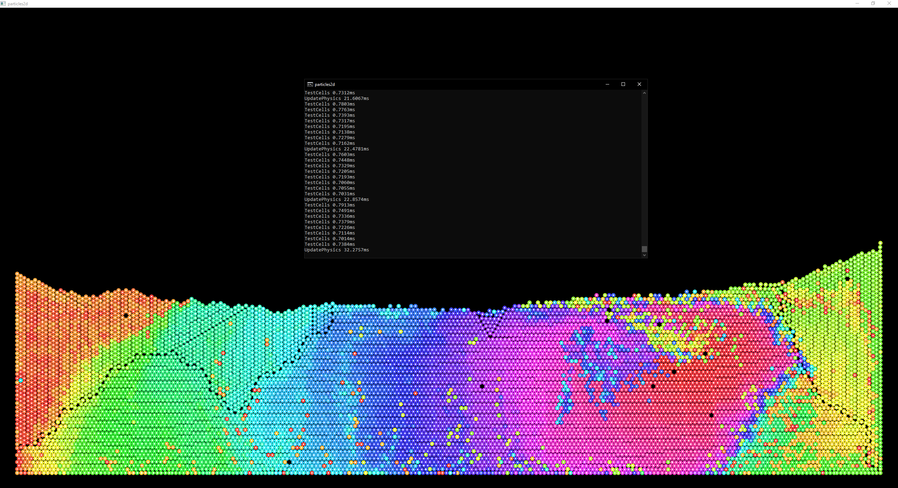
  <br />
  <code><pre>~20ms for 10,000 particles by reducing the grid size</pre></code>
</div>

<div class="video-embed" style="position: relative; padding-top: 55.05735140771637%;">
  <iframe
    src="https://customer-vv39d21derhw1phl.cloudflarestream.com/a4bbc8d006ccff65b06facb910a050e7/iframe?preload=true&poster=https%3A%2F%2Fcustomer-vv39d21derhw1phl.cloudflarestream.com%2Fa4bbc8d006ccff65b06facb910a050e7%2Fthumbnails%2Fthumbnail.jpg%3Ftime%3D%26height%3D600"
    style="border: none; position: absolute; top: 0; left: 0; height: 100%; width: 100%;"
    allow="accelerometer; gyroscope; autoplay; encrypted-media; picture-in-picture;"
    allowfullscreen="true"
  ></iframe>
</div>

<div class="center-align vmargin-1em">
  <code>
    <pre>~10ms for 40,000 particles by building the grid once per frame and using AVX2
    on a single thread</pre>
  </code>
</div>

And then it was back to the sdf-editor, which I was working on in parallel with the particle sim.

## March

<div class="center-align vmargin-1em">
  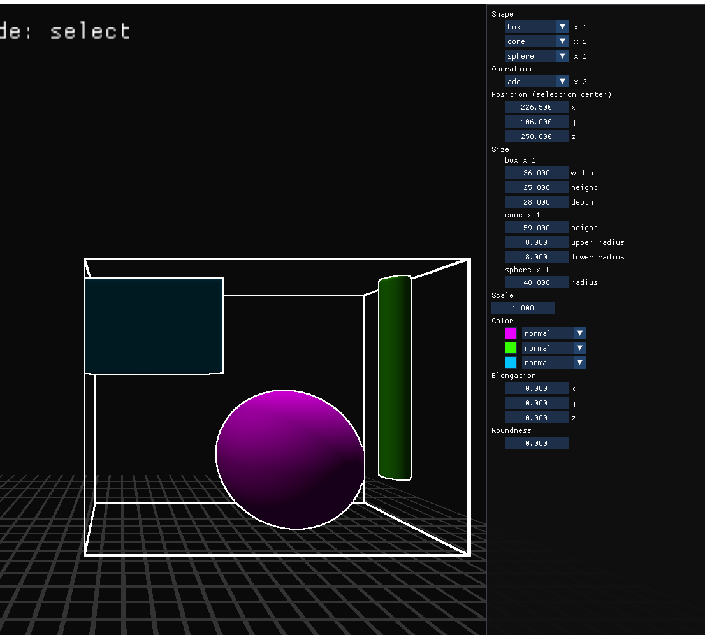
  <br />
  <code><pre>making the panel handle multi-select</pre></code>
</div>

<div class="center-align vmargin-1em">
  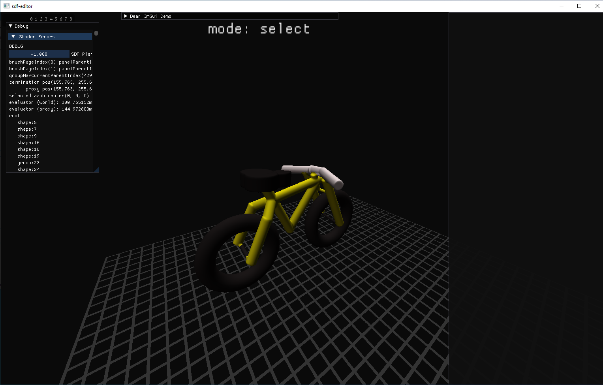
  <br />
  <code><pre>pre-alpha user testing
  takeaway: this thing is pretty hard to use</pre></code>
</div>


<div class="video-embed" style="position: relative; padding-top: 56.25%;">
  <iframe
    src="https://customer-vv39d21derhw1phl.cloudflarestream.com/f34dab03c2447d56d367df2462ba9fab/iframe?preload=true&poster=https%3A%2F%2Fcustomer-vv39d21derhw1phl.cloudflarestream.com%2Ff34dab03c2447d56d367df2462ba9fab%2Fthumbnails%2Fthumbnail.jpg%3Ftime%3D%26height%3D600"
    style="border: none; position: absolute; top: 0; left: 0; height: 100%; width: 100%;"
    allow="accelerometer; gyroscope; autoplay; encrypted-media; picture-in-picture;"
    allowfullscreen="true"
  ></iframe>
</div>

Some things were wearing on me with the sdf editor

1. Objects were limited to the size of the voxel box they were contained in. I believe this was 512<sup>3</sup>
2. In my user testing people found it hard to manipulate objects
3. After ~200 objects everything became laggy
4. The elephant in the room: composite brushes made it much more complex to optimize the evaluator, re-enforcing the
   200 object limit.
5. Controls / Panel were somewhere inbetween direct manipulation and precise control like you'd see in CAD, but it did
   neither very well. I think there is room in an editor to do both, but I missed the mark on this one.

So, I scrapped the whole thing and started designing a new system that wouldn't be forced to live inside of a voxel grid. My first thought was of panic because living on a grid is comfy. You don't have to worry about isosurface extraction and all of the degeneracies (e.g., topological issues, manifold issues) or the optimization of connecting graphs together to save on vertex bandwidth.

So after taking another glance at the current state of the art which seemed like [Digital Surface Regularization With Guarantees](https://www.computer.org/csdl/journal/tg/2021/06/09339892/1qLhYrSA4ve), I noticed that in their paper they have missing triangles!

<div class="center-align vmargin-1em">
  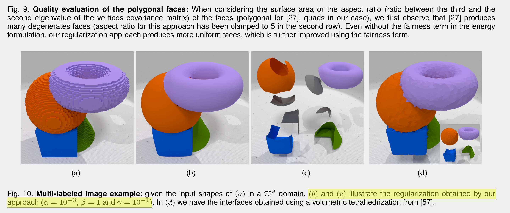
</div>

Anyway, I watched Alex Evan's [Learning From Failure](https://www.youtube.com/watch?v=u9KNtnCZDMI) talk again and though I'd give max-norm a try. One thing that I thought would be a showstopper is if I couldn't figure out how evaluate objects that had been rotated under the max-norm distance metric.

According to [Simon Brown](https://mastodon.gamedev.place/@sjb3d) the distance metric for a rotated object is the same as finding the largest aligned cube within a unit rotated cube (see: the [Max norm ellipsoid](https://www.shadertoy.com/view/Mt2XWG) shadertoy).

So I gave that a shot and came up with these two things:

- 2D: [fit a unit square into a rotate unit square on desmos](https://www.desmos.com/calculator/2syevc7h9f)
- 3D: [fit a axis aligned cube inside of a rotated unit cube](https://observablehq.com/d/9a7594f28c8983da)

- TODO: I made these before this website was launched, so it would be beneficial to port them over

<div class="center-align vmargin-1em">
  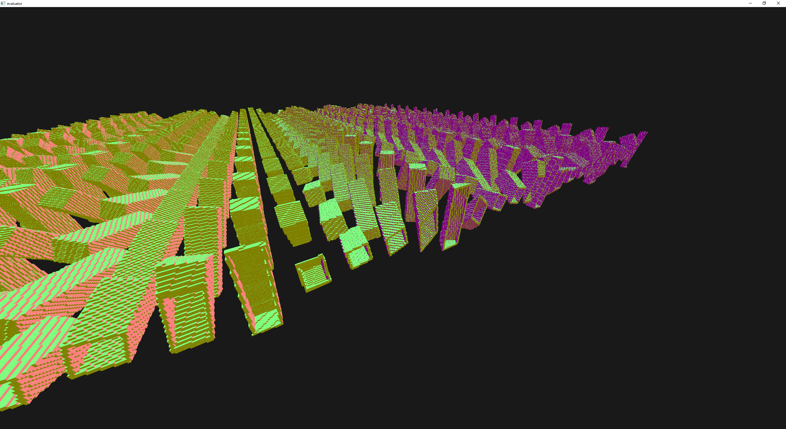
  <br />
  <code><pre>A plane of rotated boxes
  Euclidean single thread 1223ms boxes(561) steps(14794498) leaves(4056562)</pre></code>
</div>

<div class="center-align vmargin-1em">
  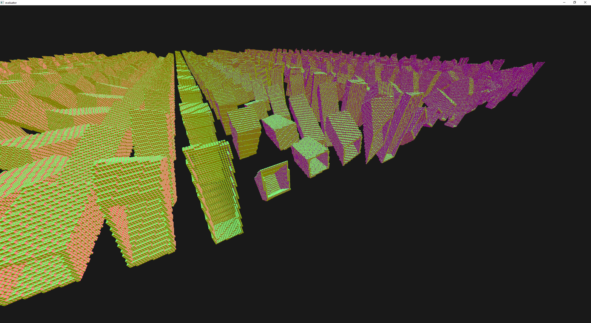
  <br />
  <code><pre>A plane of rotated boxes
  MaxNorm single thread 1037ms boxes(561) steps(14090824) leaves(3812840)</pre></code>
</div>

<div class="center-align vmargin-1em">
  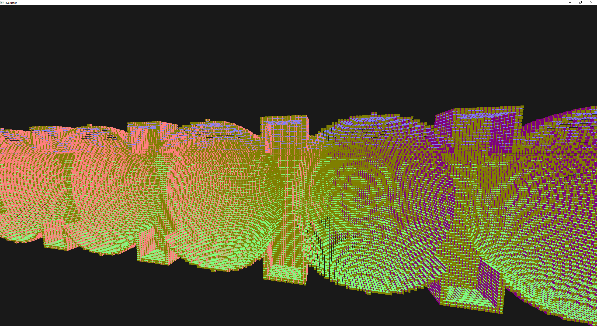
  <br />
</div>
  Things were pretty speedy under a release build
  <code><pre>scene(plane of boxes and spheres)
  Euclidean/Scalar single thread 186ms primitives(561) steps(22517064) leaves(6307840)
  Euclidean/IntervalArithmetic single thread 386ms primitives(561) steps(20804936) leaves(5726208)
  MaxNorm single thread 291ms boxes(561) steps(20804936) leaves(5726208)
  <br />
scene(plane of rotated boxes)
  Euclidean/Scalar single thread 211ms primitives(561) steps(14793252) leaves(4055356)
  Euclidean/IntervalArithmetic single thread 1053ms primitives(561) steps(19905185) leaves(5364673)
  MaxNorm single thread 167ms boxes(561) steps(14089012) leaves(3811412)</pre></code>
</p>

## April

<div class="center-align vmargin-1em">
  
</div>

After a brief stint writing a gpu evaluator, I turned my focus back to CPU evaluation because it is more general purpose. It is easier to run headless and on older machines. At this point the major downside of the evaluator is that it still operated over a fixed sized grid, building an octree. However, the multithreaded octree building approach that I was considering for the GPU scared me into avoiding it on the CPU.

<div class="center-align vmargin-1em">
  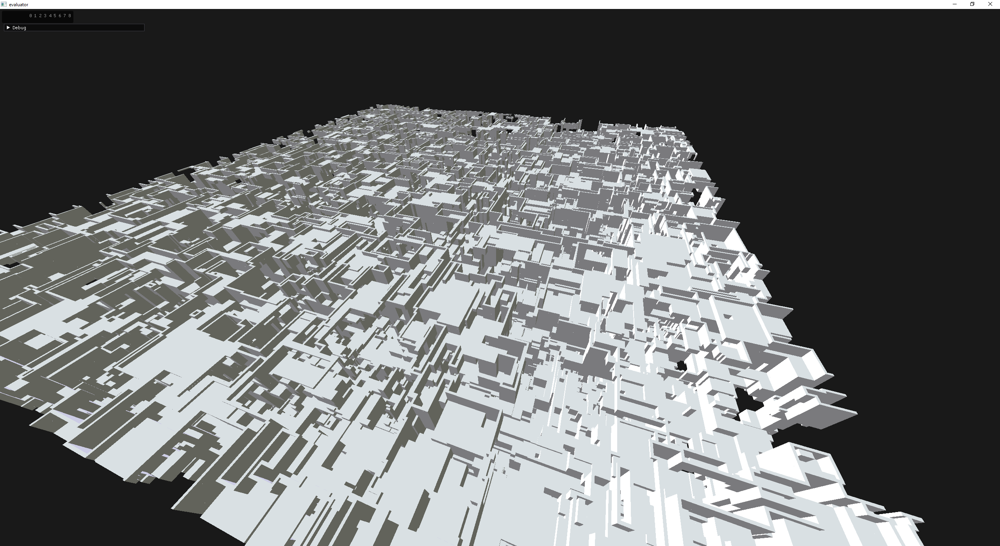
  <code><pre>64k random boxes</pre></code>
</div>

<div class="center-align vmargin-1em">
  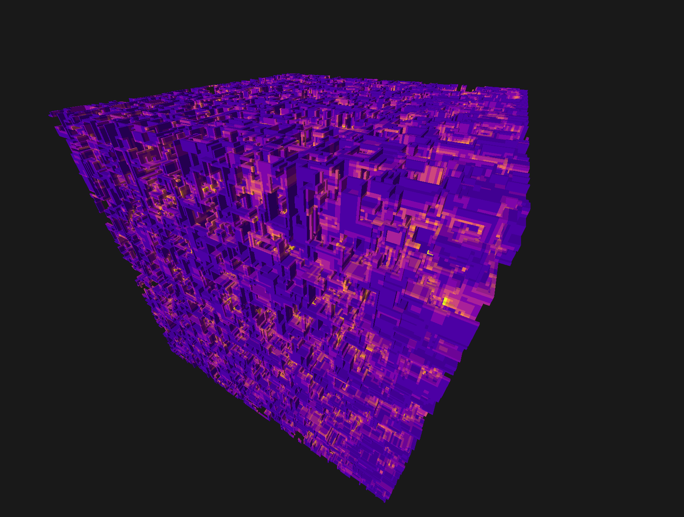
  <code><pre>64k random boxes - heatmap for primitive overlaps (1..8)</pre></code>
</div>

I came up with the notion of having each thread running over an implicit grid, filtering primitives based on the grid cell and if there were overlaps then the thread subdivides the cell recursively to find the leaves. On the cpu this makes a ton of sense because we have large caches and stacks are basically free. By limiting the size of the chunks we also limit the depth of the traversal which makes tuning this with a single knob possible.


<div class="center-align vmargin-1em">
  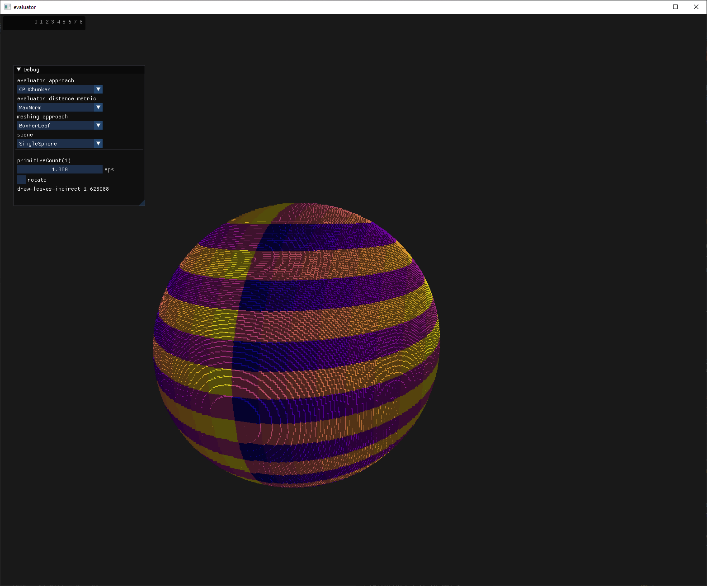
  <code><pre>The Chunker<sup>TM</sup></pre></code>
</div>

<div class="center-align vmargin-1em">
  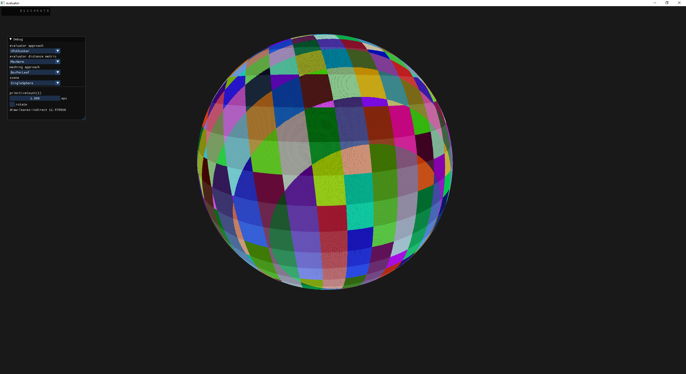
  <code><pre>identifying the chunks associated with regions of the sphere</pre></code>
</div>


<div class="center-align vmargin-1em">
  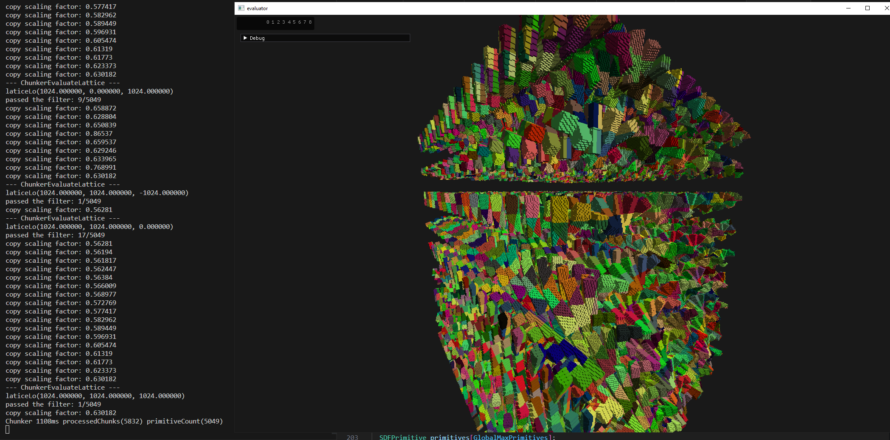
  <code><pre>box of rotated boxes</pre></code>
</div>


<div class="center-align vmargin-1em">
  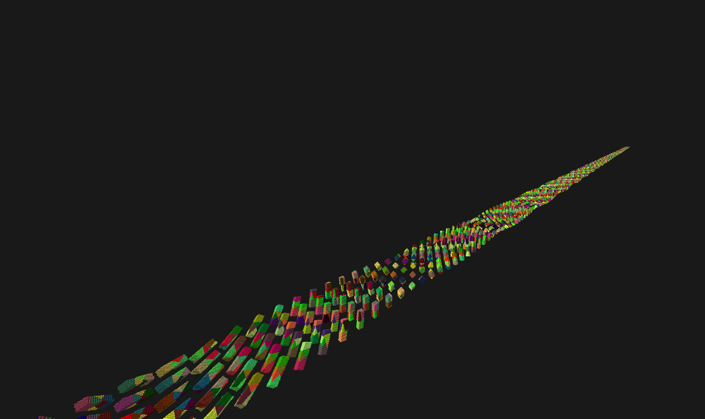
  <code><pre>finally I've broken free of world size limits</pre></code>
</div>

At this point things were working pretty well, but my meshing strategy was a mess. Each chunk was being meshed, and since we don't know whats going on in the neighborhood (without dependency tracking or some other complexity) the mesher would mesh the inside and the outside of the isosurface. This effectively means that we're paying double the cost for meshing and double the cost for rendering.

To improve on this I thought back to one of many invaluable tips that [Sebastian Aaltonen](https://twitter.com/SebAaltonen) mentioned on twitter about [generating cube vertices in a vertex shader](https://twitter.com/SebAaltonen/status/1322594445548802050). By implementing this I was able to reduce the meshing time by ~80% (354ms -> 81ms) and the rendering time by ~60% (40ms -> 16ms) for 15 million leaves!

<div class="center-align vmargin-1em">
  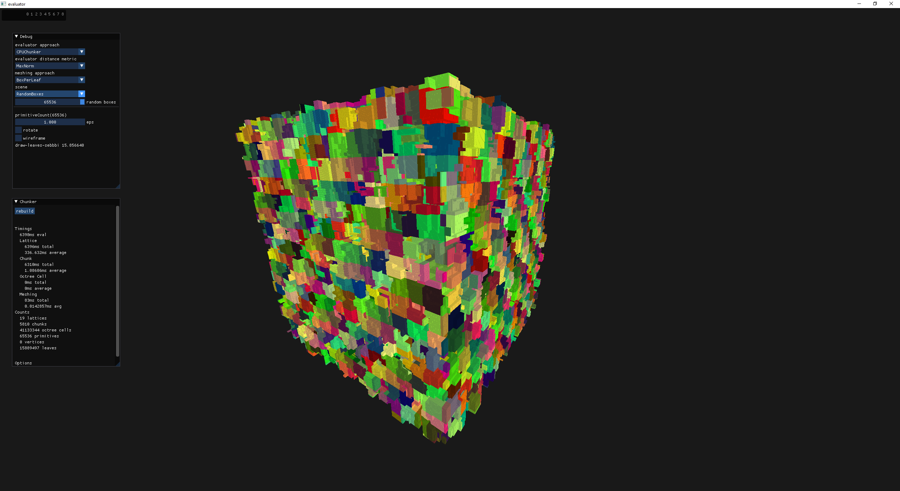
</div>

## May

<div class="center-align vmargin-1em">
  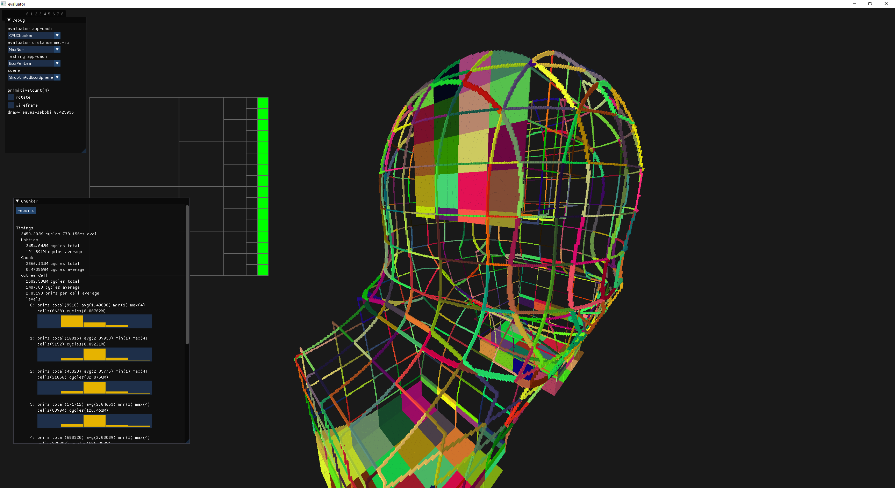
</div>

```c++
// tweak the svo sampler to pull out some of the lattice
static f32
ChunkSVOSample(const ChunkSVO *svo, i32 x, i32 y, i32 z) {
  if (x < 0 || y < 0 || z < 0 || x >= 64 || y >= 64 || z >= 64) {
    return 1.0f;
  } else {
    return 0.0f;
  }
}
```

Now, the next thing bugging me was my lack of understand of how the evaluator was working in the octree. It still wasn't super fast, but I didn't have any data to inform how to optimize. So I decided to shine some light on what the evaluator was doing at each level of the octree by aggregating the data into a histogram.

<div class="center-align vmargin-1em">
  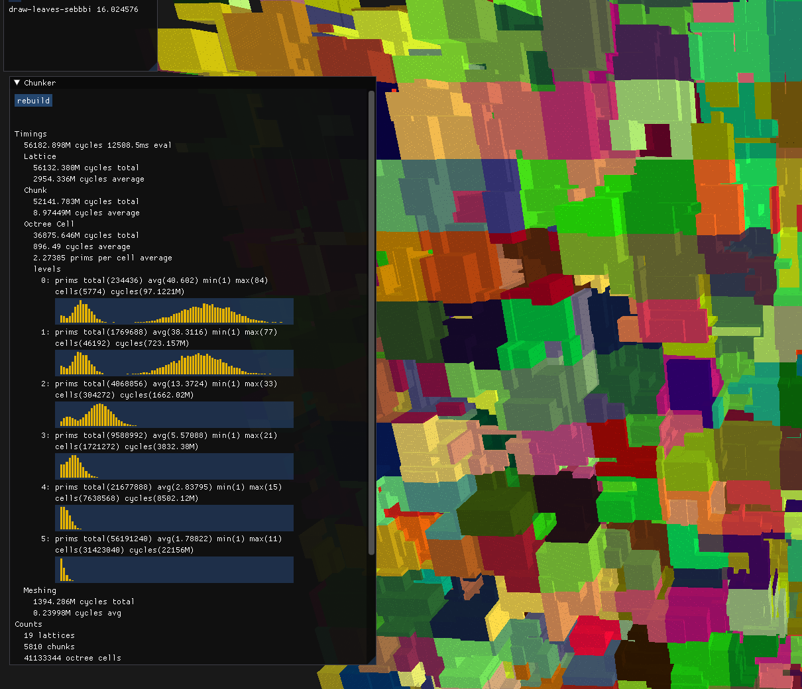
  <code><pre>Chunker histogram</pre></code>
</div>

At level 0, the prims per cell is the highest, but this ratio quickly drops down and we end up swapping from performing many primitive evaluations per cell to many cell evaluations against very few primitives.

<div class="center-align vmargin-1em">
  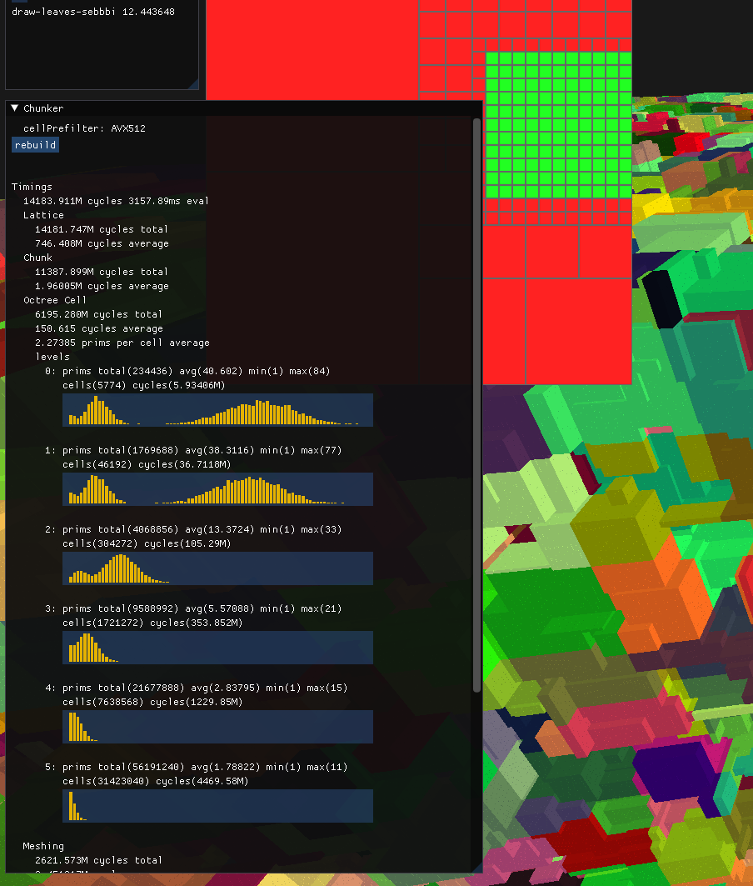
  <code><pre>4x faster with very basic avx512 usage
  Prefiltering primitive bounding boxes against the chunks</pre></code>
</div>

Initially I wrote the visualization side of the evaluator as just a way to debug what it was doing. As things progressed and I added more and more functionality to it, I realized that this thing was actually fast enough to use interactively.

<div class="center-align vmargin-1em">
  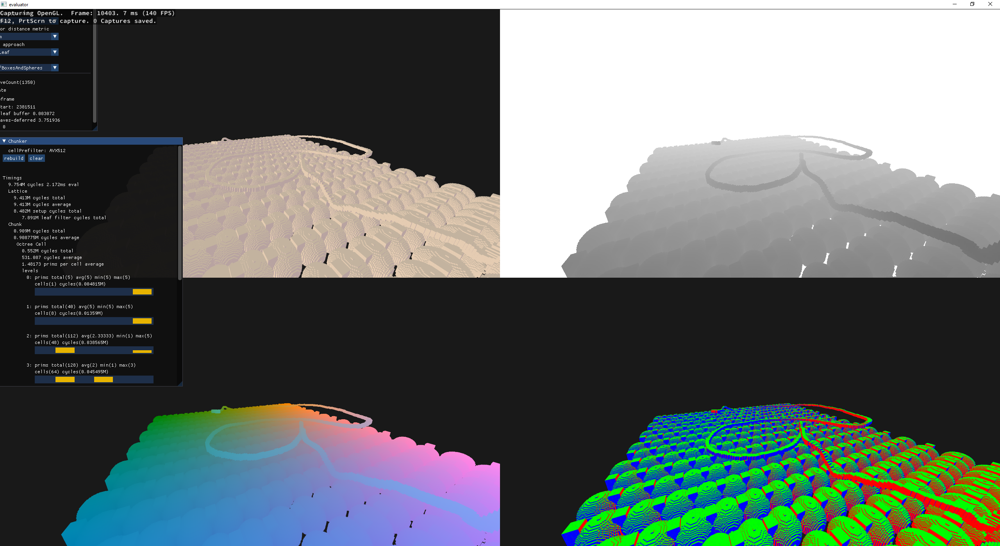
  <code><pre>added g-buffer support</pre></code>
</div>

<div class="center-align vmargin-1em">
  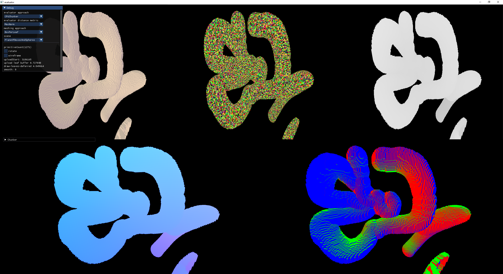
  <code><pre>added leaf id to the g-buffer</pre></code>
</div>

<div class="center-align vmargin-1em">
  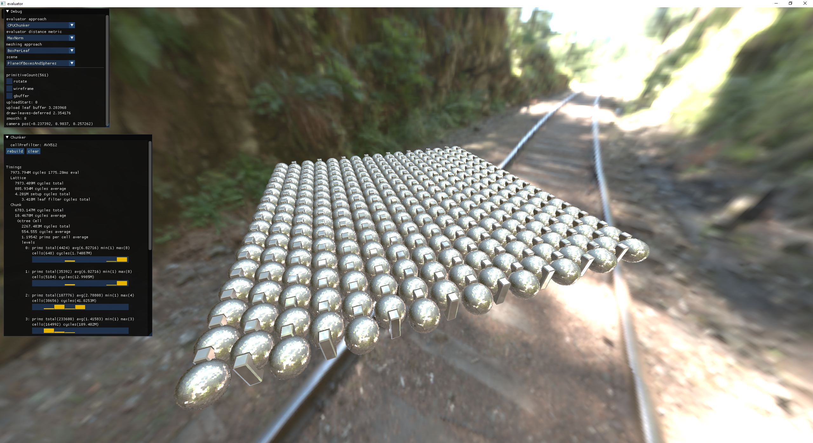
  <code><pre>deferred image based lighting</pre></code>
</div>

<div class="center-align vmargin-1em">
  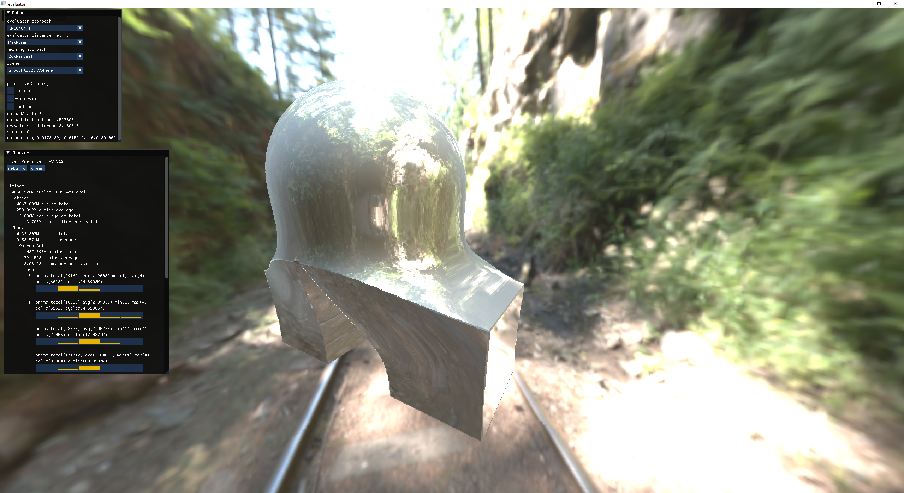
  <code><pre>deferred image based lighting</pre></code>
</div>

<div class="center-align vmargin-1em">
  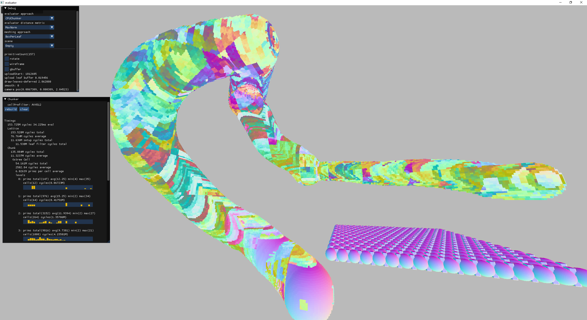
  <code><pre>bug with normals for added primitives</pre></code>
</div>

<div class="center-align vmargin-1em">
  
  <code><pre>fixed bug with normals for added primitives</pre></code>
</div>

Now that I had a g-buffer, we turn once again to Sebbbi's twitter, this time for [Hi-Z Culling](https://twitter.com/SebAaltonen/status/1610302009692798979). The basic idea is that you use the previous frame's depth buffer to cull objects in the current frame that would be behind last frame's objects.

<div class="center-align vmargin-1em">
  
  <code><pre>hi-z culling from <a href="https://advances.realtimerendering.com/s2015/aaltonenhaar_siggraph2015_combined_final_footer_220dpi.pdf">GPU-Driven Rendering Pipelines
</a></pre></code>
</div>

Results:

<div class="center-align vmargin-1em">
  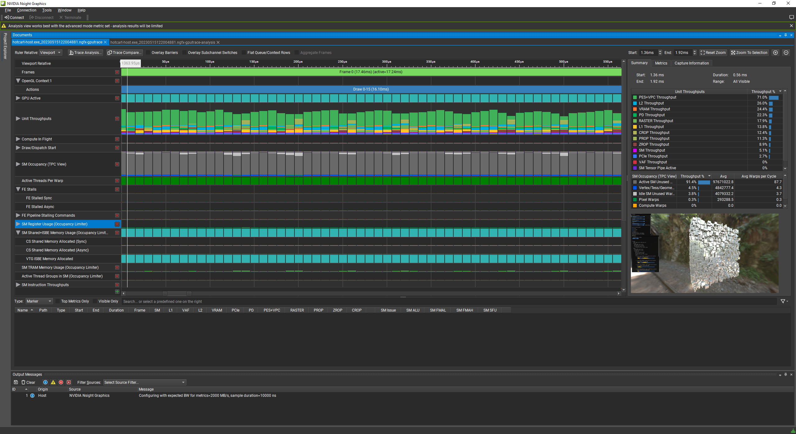
  <code><pre>before hi-z culling: 16ms per frame</pre></code>
</div>

<div class="center-align vmargin-1em">
  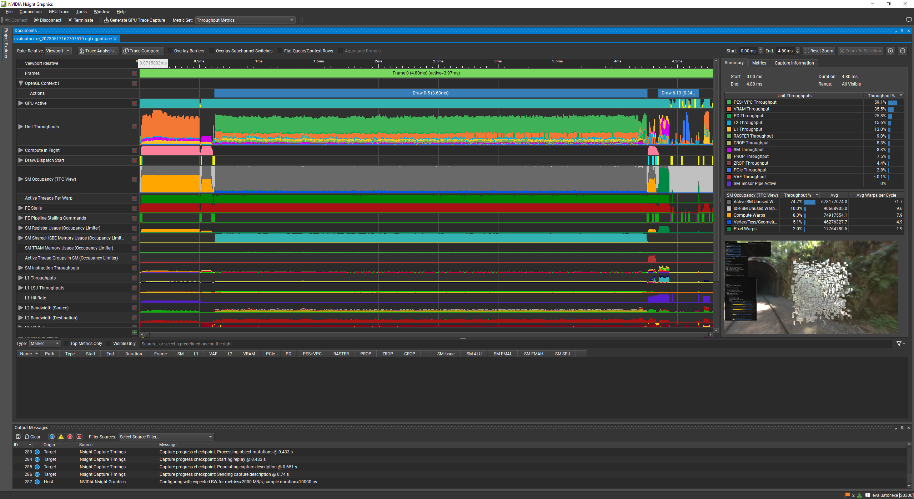
  <code><pre>after hi-z culling: 3.6ms per frame</pre></code>
</div>


<div class="center-align vmargin-1em">
  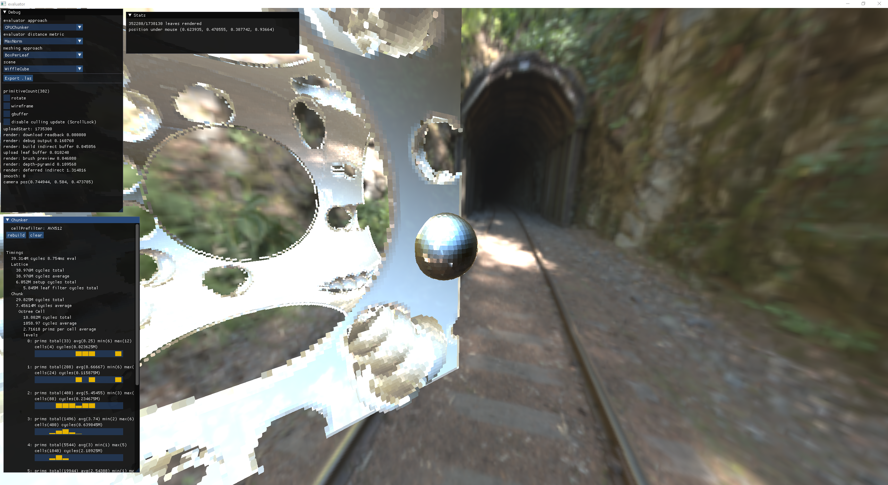
  <code><pre>brush preview: additive sphere</pre></code>
</div>

<div class="center-align vmargin-1em">
  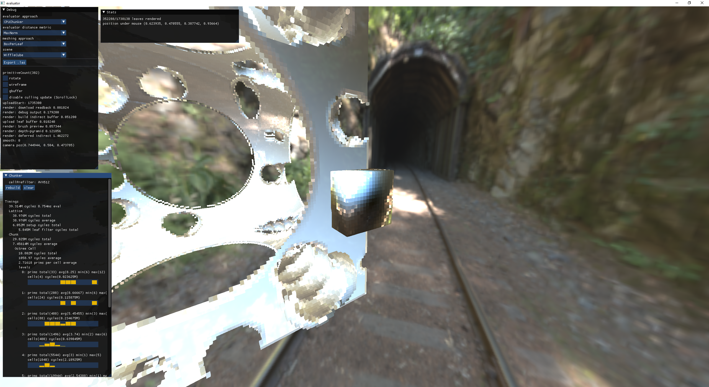
  <code><pre>brush preview: additive cube</pre></code>
</div>

So at this point, the brush preview was functional and the brush itself was locked to the surface under the mouse. So it was time to try and actually use the thing to make something other than squiggles.


<div class="center-align vmargin-1em">
  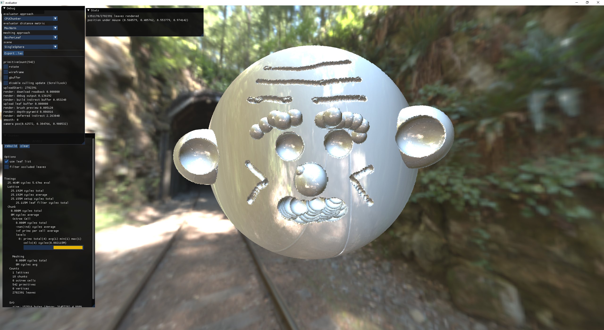
  <code><pre>my first sculpt with this system</pre></code>
</div>

The main issue with the system at this point is finding the surface under the mouse. I was doing a readback from the GPU which was causing a noticable lag. So I spent some time trying to optimize that readback, but was unable to get it to feel right. I'll probably have to revisit this at some point.

<div class="center-align vmargin-1em">
  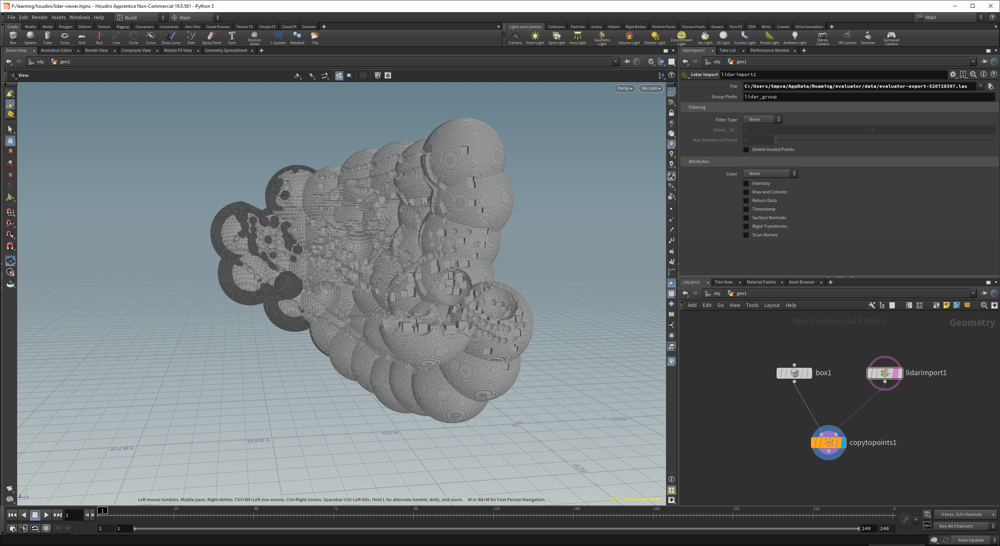
  <code><pre>.las file (LIDAR) exporter and houdini import</pre></code>
</div>

<div class="video-embed" style="position: relative; padding-top: 56.25%;">
  <iframe
    src="https://customer-vv39d21derhw1phl.cloudflarestream.com/46312f20357998d7729fd319351f8288/iframe?preload=true&poster=https%3A%2F%2Fcustomer-vv39d21derhw1phl.cloudflarestream.com%2F46312f20357998d7729fd319351f8288%2Fthumbnails%2Fthumbnail.jpg%3Ftime%3D%26height%3D600"
    style="border: none; position: absolute; top: 0; left: 0; height: 100%; width: 100%;"
    allow="accelerometer; gyroscope; autoplay; encrypted-media; picture-in-picture;"
    allowfullscreen="true"
  ></iframe>
</div>
<div class="center-align vmargin-1em">
<code><pre>video by <a href="https://mastodon.gamedev.place/@rh2">@rh2</a> - drawn in my puny sdf editor, simulated in houdini, and  rendered in blender
check out their awesome SBSAR (substance designer) materials on <a href="https://swizzle.fun/" target="_blank">swizzle.fun</a></pre></code>
</div>

At this point I'm really happy with the performance and how fast it is to spam new primitives. The chunker made evaluating dirty/new regions super convenient. So I started adding support for materials, starting with global materials just to prove that I had the pipeline setup and things looked reasonably close to what I'd expect. My assumption is that this is a rough pass that I'll have to keep iterating on.

<div class="center-align vmargin-1em">
  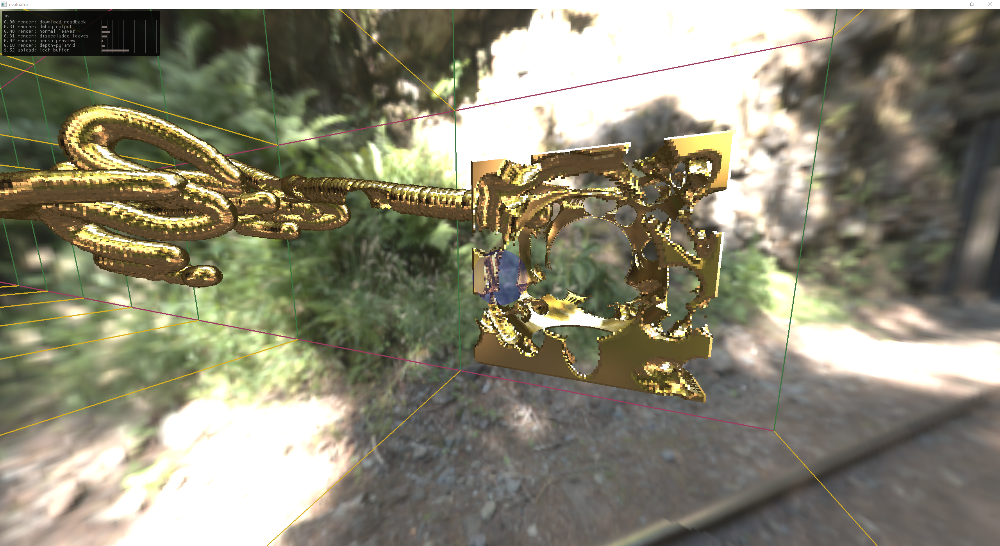
  <code><pre>gold-like material</pre></code>
</div>

<div class="center-align vmargin-1em">
  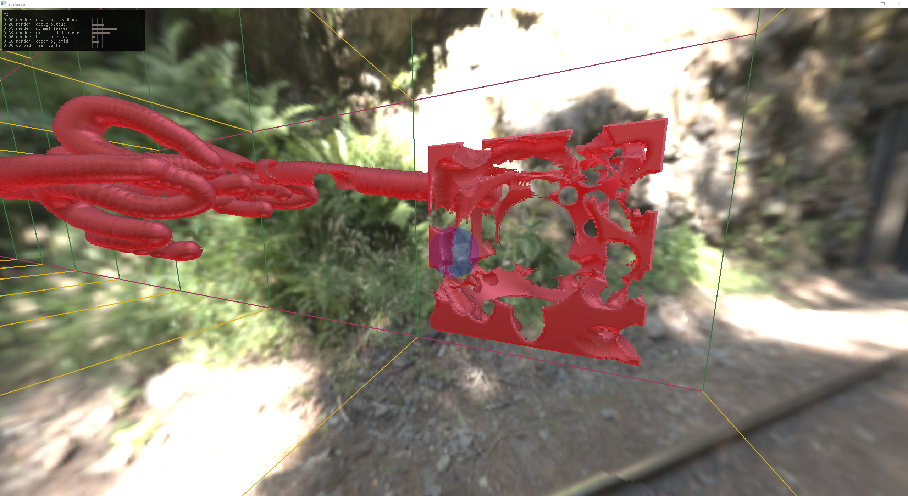
  <code><pre>plastic-like material</pre></code>
</div>

With the global materials working, it's time to attach a material to every leaf based on the associated primitive!

<div class="center-align vmargin-1em">
  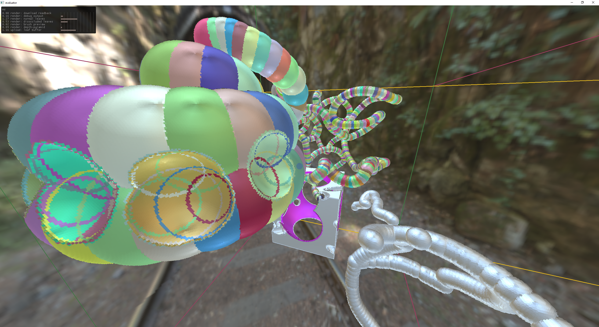
  <code><pre>graph coloring of primitive id for material color</pre></code>
</div>

<div class="center-align vmargin-1em">
  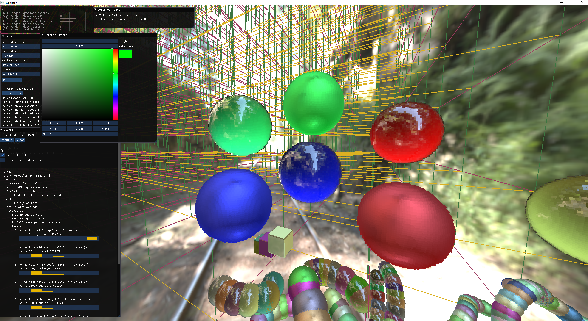
  <code><pre>editable materials</pre></code>
</div>

And because we now have user selectable color, the `.las` exported gets support.

<div class="center-align vmargin-1em">
  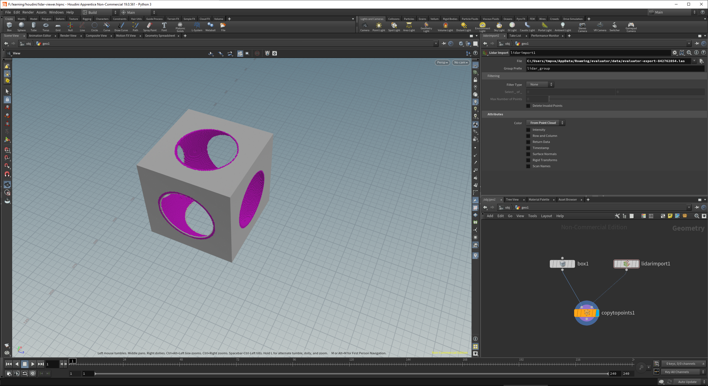
</div>

<div class="center-align vmargin-1em">
  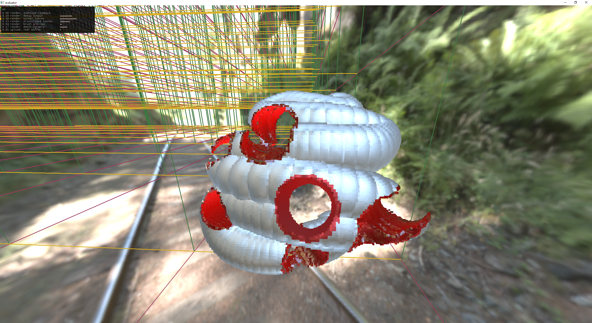
  <code><pre>cuts take the cutter material</pre></code>
</div>

Learning from the earlier user testing of the earlier sdf editor, I opted to start working on a menu that can house all of the actions you can take. Hotkeys can be added later. The idea was a multi-level radial menu, in the pixel art aesthetic.

<div class="center-align vmargin-1em">
  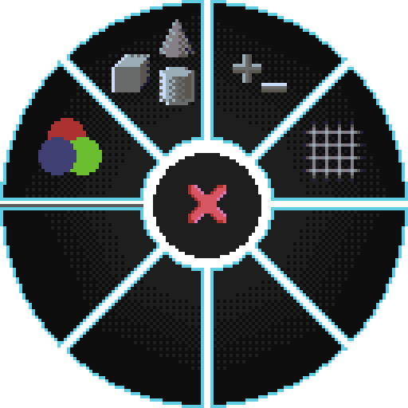
  <code><pre>radial menu</pre></code>
</div>

<div class="video-embed" style="position: relative; padding-top: 56.25%;">
  <iframe
    src="https://customer-vv39d21derhw1phl.cloudflarestream.com/07baface9209e678f77979f1d01a56d1/iframe?preload=true&poster=https%3A%2F%2Fcustomer-vv39d21derhw1phl.cloudflarestream.com%2F07baface9209e678f77979f1d01a56d1%2Fthumbnails%2Fthumbnail.jpg%3Ftime%3D%26height%3D600"
    style="border: none; position: absolute; top: 0; left: 0; height: 100%; width: 100%;"
    allow="accelerometer; gyroscope; autoplay; encrypted-media; picture-in-picture;"
    allowfullscreen="true"
  ></iframe>
</div>

Well that worked really well, how about tackling the brush manipulation problem?

<div class="video-embed vmargin-1em" style="position: relative; padding-top: 53.90625%;">
  <iframe
    src="https://customer-vv39d21derhw1phl.cloudflarestream.com/5feded166174aada4a88467baad4f548/iframe?preload=true&poster=https%3A%2F%2Fcustomer-vv39d21derhw1phl.cloudflarestream.com%2F5feded166174aada4a88467baad4f548%2Fthumbnails%2Fthumbnail.jpg%3Ftime%3D%26height%3D600"
    style="border: none; position: absolute; top: 0; left: 0; height: 100%; width: 100%;"
    allow="accelerometer; gyroscope; autoplay; encrypted-media; picture-in-picture;"
    allowfullscreen="true"
  ></iframe>
</div>

<div class="video-embed  vmargin-1em" style="position: relative; padding-top: 53.834115805946794%;">
  <iframe
    src="https://customer-vv39d21derhw1phl.cloudflarestream.com/8387cc007ea0507fbd66635626331aba/iframe?preload=true&poster=https%3A%2F%2Fcustomer-vv39d21derhw1phl.cloudflarestream.com%2F8387cc007ea0507fbd66635626331aba%2Fthumbnails%2Fthumbnail.jpg%3Ftime%3D%26height%3D600"
    style="border: none; position: absolute; top: 0; left: 0; height: 100%; width: 100%;"
    allow="accelerometer; gyroscope; autoplay; encrypted-media; picture-in-picture;"
    allowfullscreen="true"
  ></iframe>
</div>

<br />

<div class="center-align vmargin-1em">
  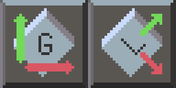
  <code><pre>global vs local transform icons</pre></code>
</div>

## June

<div class="center-align vmargin-1em">
  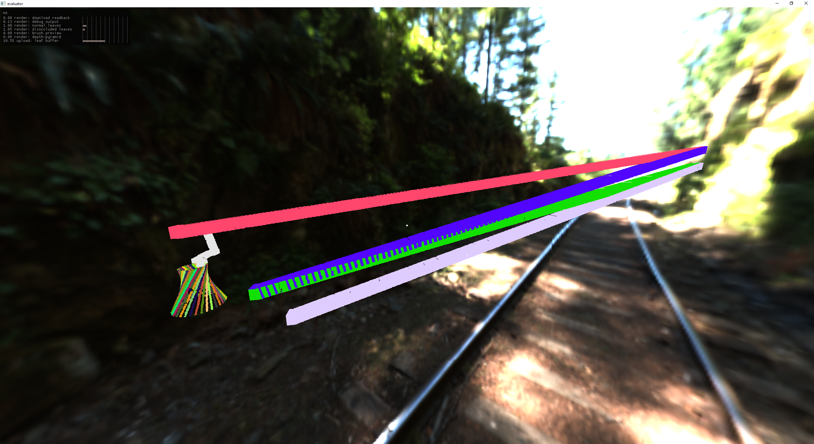
  <code><pre>janky max-norm lines based on <a href="https://www.shadertoy.com/view/7l2GWR">Segment - distance L-inf</a></pre></code>
</div>

<div class="center-align vmargin-1em">
  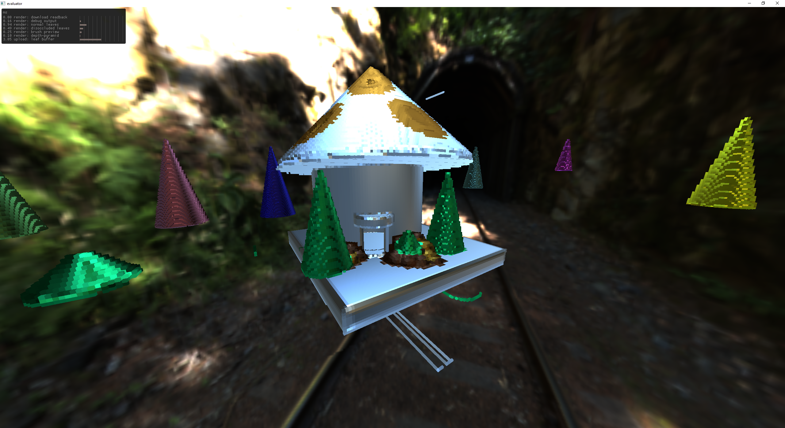
  <code><pre>toadstool life (aka I added cones!)</pre></code>
</div>

I was having some trouble making things that looked really good by hand, and I knew that I wanted some trees so I decide to look into how to procgen some trees.

<div class="center-align vmargin-1em">
  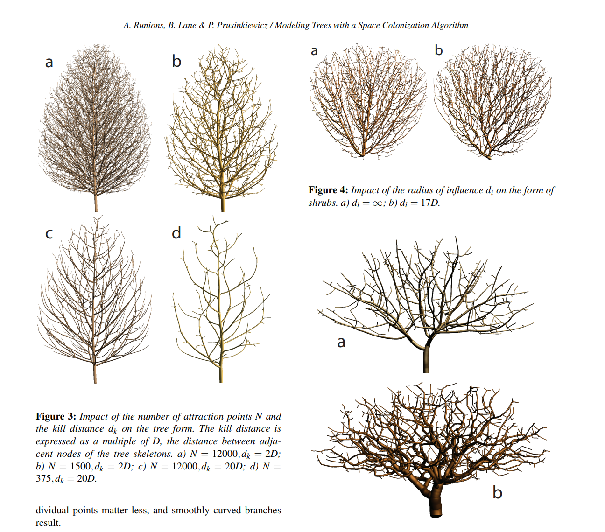
  <code><pre><a href="http://algorithmicbotany.org/papers/colonization.egwnp2007.large.pdf">Modeling Trees with a Space Colonization Algorithm</a></pre></code>
</div>

<div class="center-align vmargin-1em">
  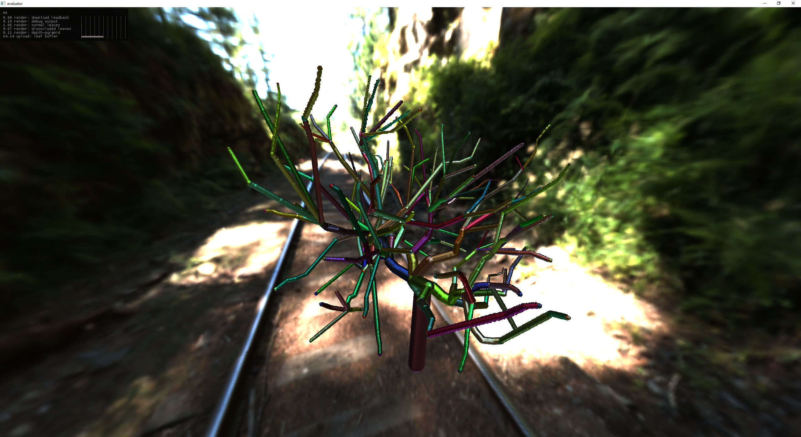
  <code><pre>a generated tree</pre></code>
</div>
<div class="center-align vmargin-1em">
  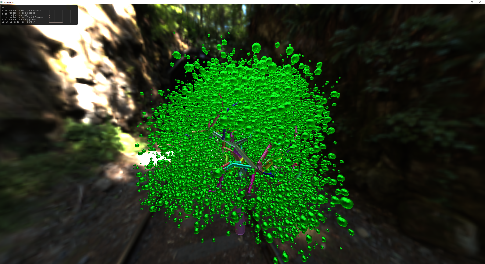
  <code><pre>a generated tree with leaves (spheres) @ 30k total sdf primitives</pre></code>
</div>

<div class="center-align vmargin-1em">
  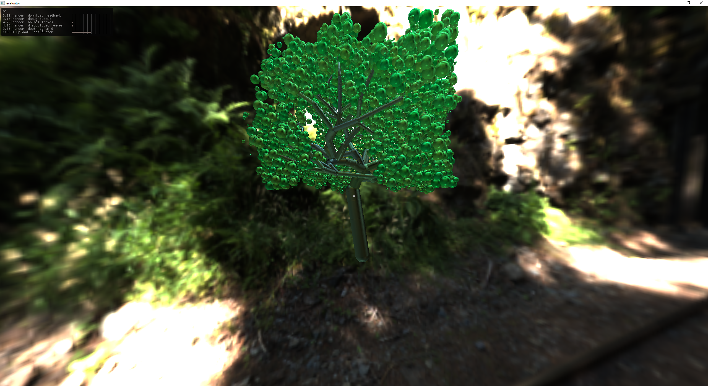
  <code><pre>leaf filter + better colors</pre></code>
</div>

<div class="center-align vmargin-1em">
  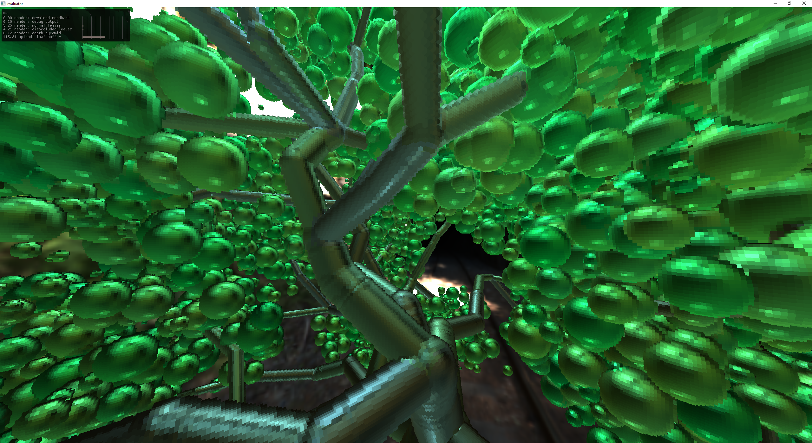
  <code><pre>inside looking out</pre></code>
</div>


## July

### Wave Function Collapse

<div class="center-align vmargin-1em">
  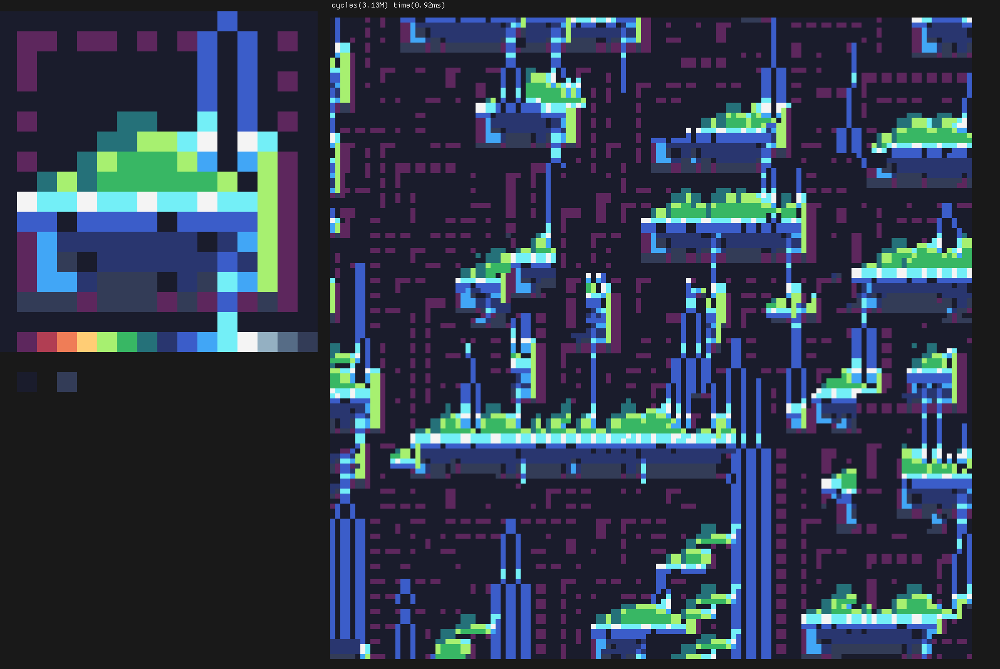
  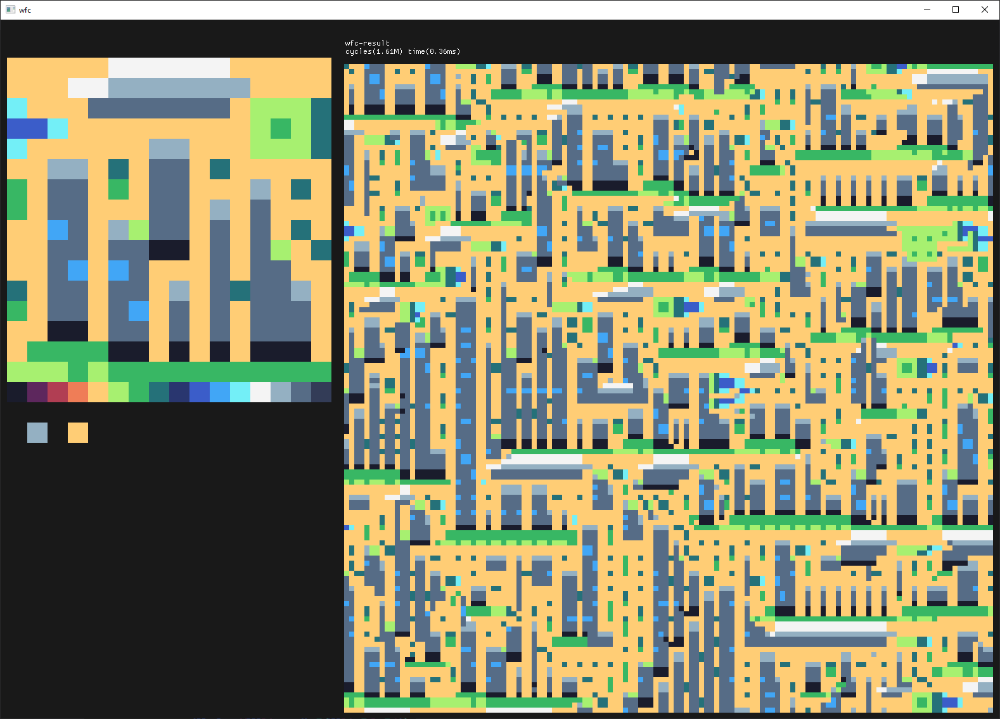
  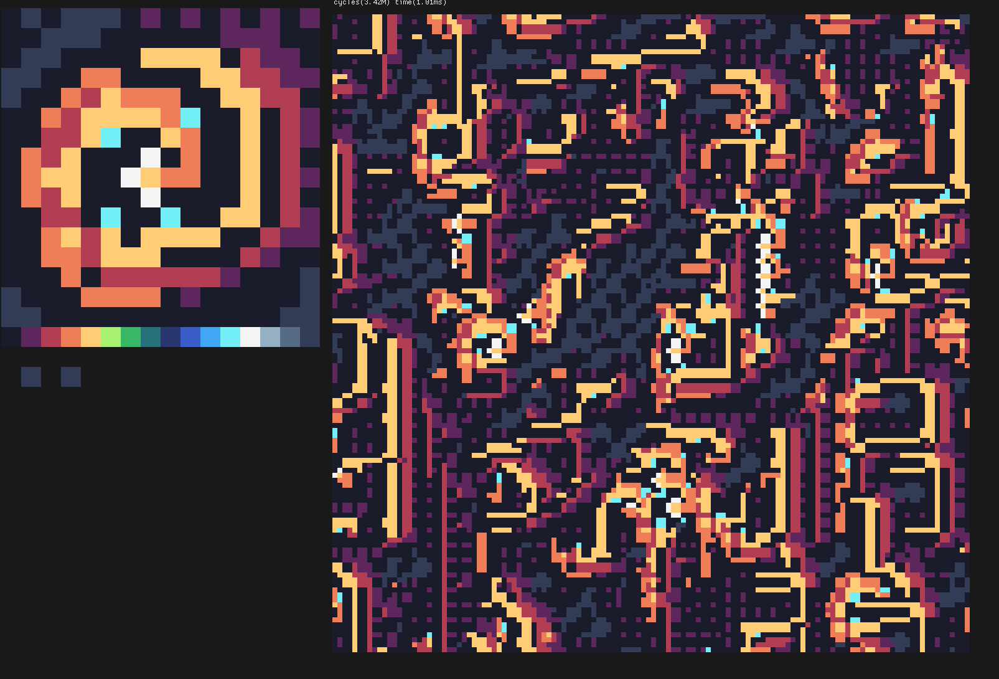
  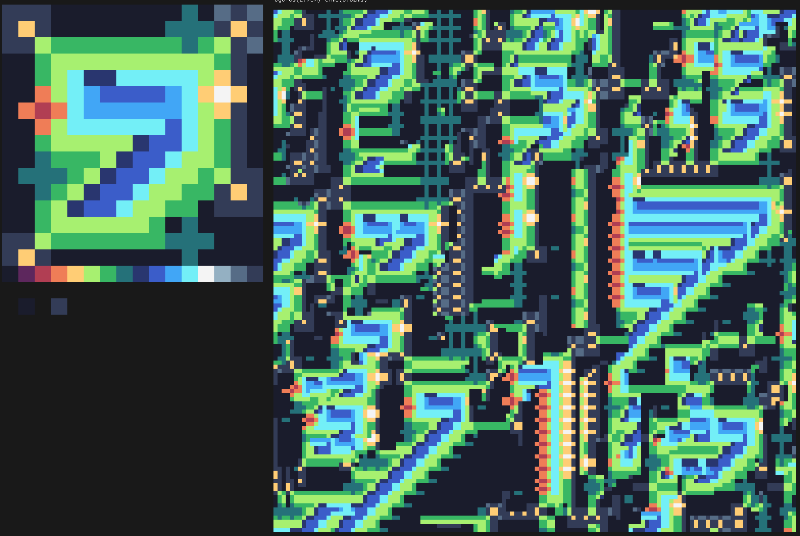
  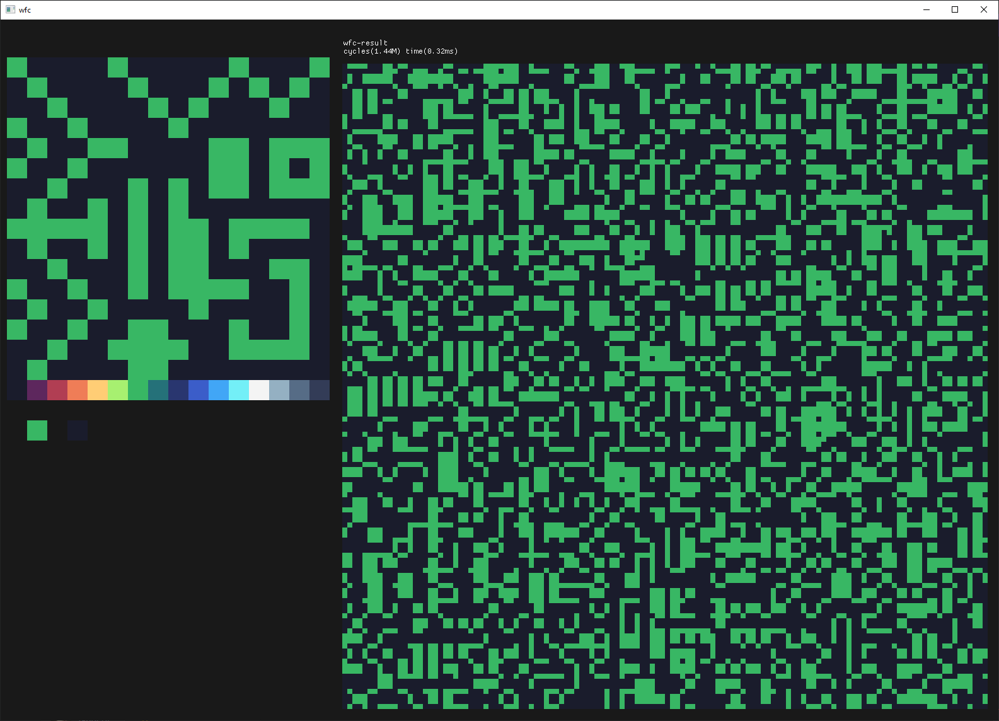
  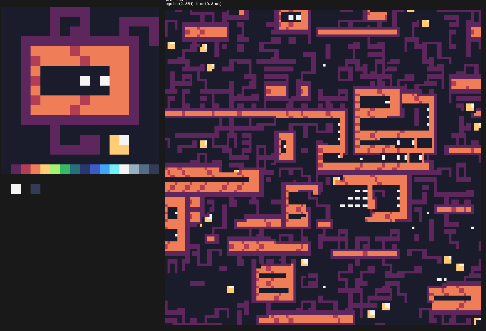
  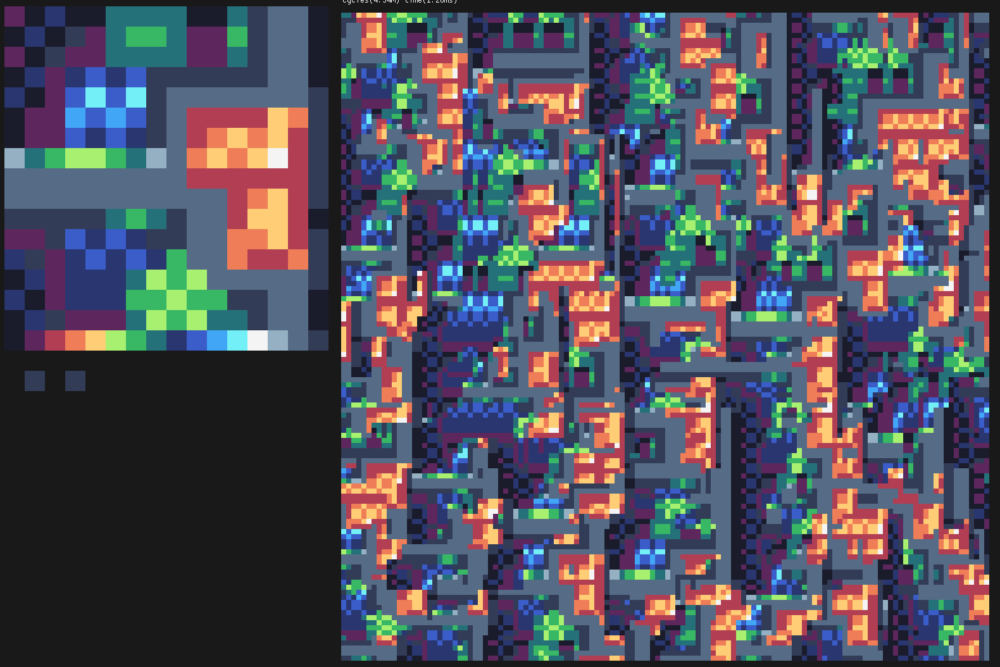
  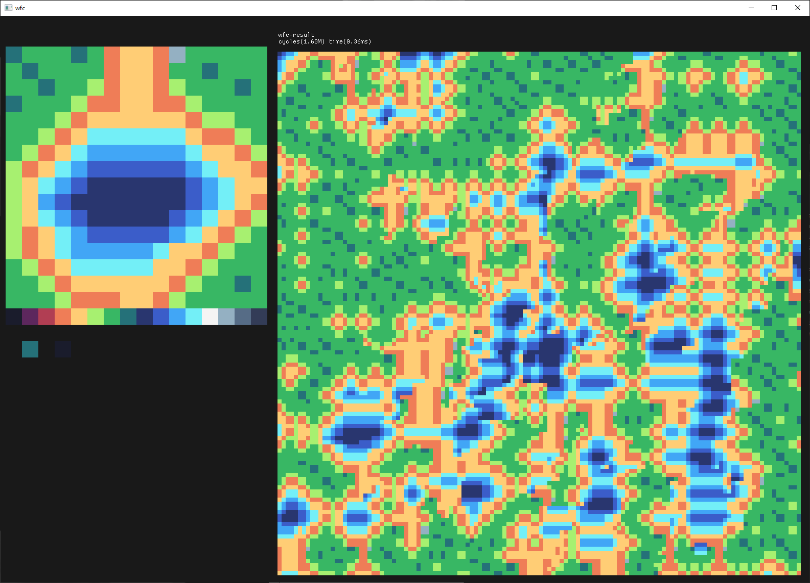
</div>


## August

## September

## October

## November