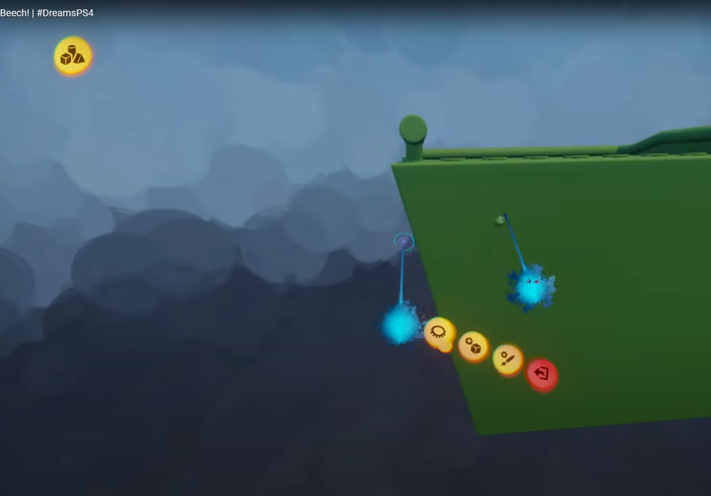
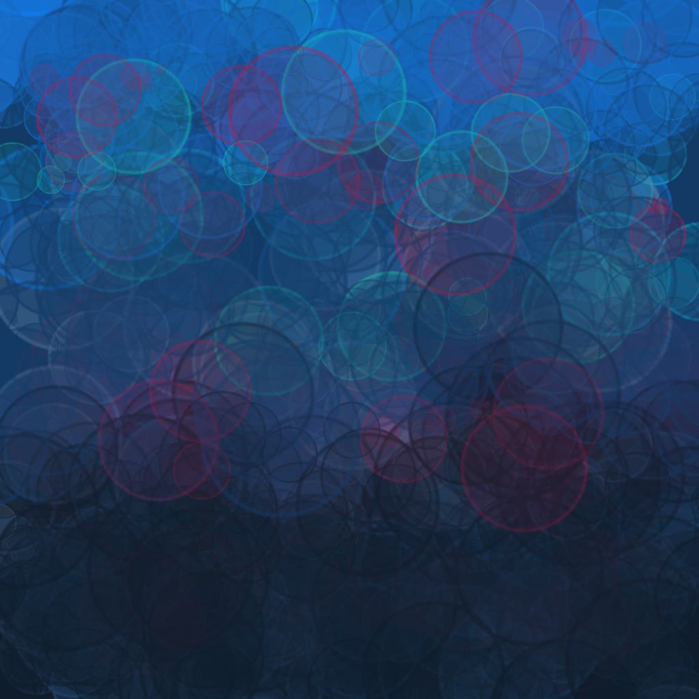
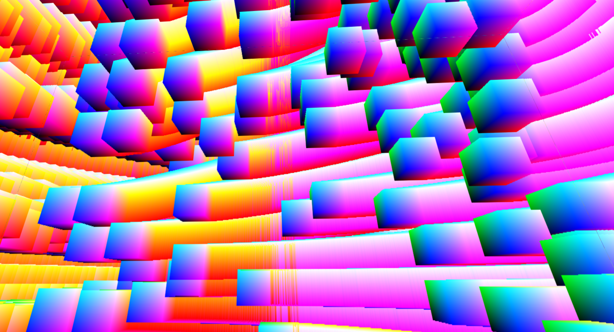

+++
title = "Dynamic Cubemaps"
date = 2023-10-19
[extra]
unlisted = false
enableSampleImage = true
+++

While watching <a href="https://twitter.com/johnee_b" target="_blank">John Beech</a> work in MM Dreams, I noticed the background and had to try and replicate it. This effort resulted in a easy method of rendering painterly / cloudy looking backgrounds, with the added benefit of being very flexibly while remaining cheap.

<!-- more -->

  <iframe
    src="https://customer-vv39d21derhw1phl.cloudflarestream.com/f8dfc63da81beb0fb85e5efaae1eb457/iframe?preload=true&poster=https%3A%2F%2Fcustomer-vv39d21derhw1phl.cloudflarestream.com%2Ff8dfc63da81beb0fb85e5efaae1eb457%2Fthumbnails%2Fthumbnail.jpg%3Ftime%3D%26height%3D600"
    style="border: none; position: absolute; top: 0; left: 0; height: 100%; width: 100%;"
    allow="accelerometer; gyroscope; autoplay; encrypted-media; picture-in-picture;"
    allowfullscreen="true"
  ></iframe>

## Inspiration

  
  

    A screenshot captured from an awesome MM Dreams stream   <a href="https://youtu.be/MumfFRy5IzI?t=1857" target="_blank">https://youtu.be/MumfFRy5IzI?t=1857</a>
  

It occurred to me that they are just accumulating splats on the background, so I hopped into Krita and spammed to circles to see how it looked - I really liked the results and how simple it was to make this effect.

  
  

    Manually spamming circles in Krita
  

## Approach

The main idea here is that you need to render to 6 different textures, one for each face of a cube. By leaving the previous cubemap's contents, but turning on alpha blending you get this nice incremental effect that looks like rain or brush strokes. Anything can be rendered to these textures, including fullscreen shader passes (e.g., <a href="https://shadertoy.com" target="_blank">shadertoy</a> shaders). Care must be taken to make sure the corners/edges match or it will look pretty terrible.

Since my goal is to match the effect seen in Dreams, adding a few (10-100) randomly positioned splats per frame seemed like a good place to start. I tried `GL_POINTS` first, but couldn't get consistent UVs across cube seams.

  
  

    Early attempt with clearly visible seams and weird UV flipping
  

This could probably be rectified with billboarded quads, but I had a wild idea about putting some volumetric data in each splat. In other words, I needed to be rendering boxes.

  
  

    Consistent UVW across cubemap faces
  

If you look really close you can still see some seams, but it turns out those artifacts were created while rendering the cubemap to the screen and fixed by computing a more accurate direction vector.

## Implementation

- setup
  1. create cubemap
  2. pre-compute VP matrices
- frame
  1. render N boxes to each face of the cubemap
      - generate random box positions in vertex shader
      - render procedural / volumetric data in fragment shader
  2. render the cubemap

<section id="dynamic-cubemaps-content">
  <section class="center-align">
    <canvas width="1024" height="512"></canvas>
  </section>
  

      source (webgl2): <a href="dynamic-cubemaps.js" target="_blank">dynamic-cubemaps.js</a>
  

  
</section>

## Conclusion

So there you have it, a simple way to render painterly backgrounds using ~100 cubes rendered 6 times per frame. The hardest part about this whole thing was setting up the framebuffers.

## References

- <a href="https://mbroecker.com/project_dynamic_cubemapping.html" target="_blank">Dynamic cubemaps with OpenGL 2</a>
- <a href="https://learnopengl.com/Advanced-OpenGL/Cubemaps" target="_blank">LearnOpengL Cubemaps</a>
- <a href="https://www.khronos.org/opengl/wiki/Cubemap_Textures" target="_blank">OpenGL Wiki Cubemap Texture</a>
- <a href="https://webgl2fundamentals.org/webgl/lessons/webgl-cube-maps.html">WebGL2 Fundamentals - Cubemaps</a>

