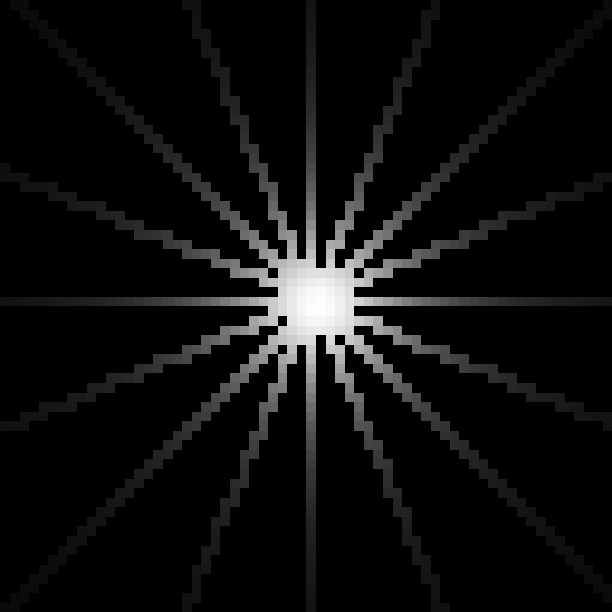
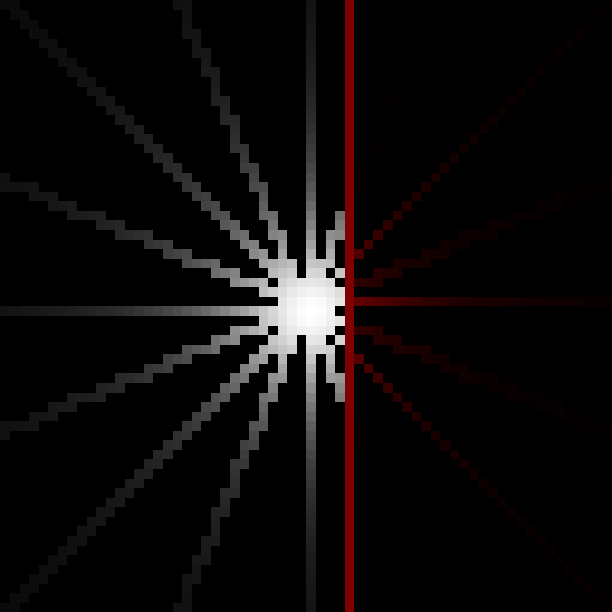
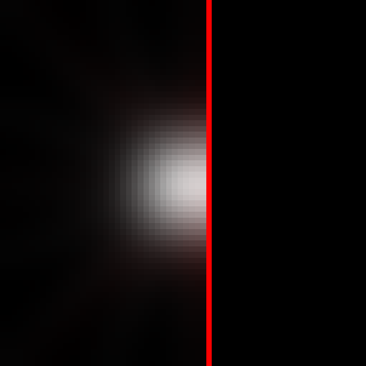

+++
title = "Blur Based 2D Realtime Radiosity (CPU)"
date = 2019-11-27
+++

<section class="center-align">
<video controls>
<source src="assets/radiosity-sand-sim.mp4" type="video/mp4" />
</video>
</section>

<p class="caption">A video of this approach, everything is fully dynamic (lights & occluders)</p>

This experiment is an attempt to find a simple & parallel algorithm for lighting a scene with low-frequency light (read: global illumination, soft shadows). This approach stems from [radiosity](https://en.wikipedia.org/wiki/Radiosity_(computer_graphics)), so instead of shooting rays from every visible surface to each light we instead fill a grid with energy from each light.

There is a ton of prior art for this approach:

- [https://www.cg.tuwien.ac.at/research/rendering/rays-radio/](https://www.cg.tuwien.ac.at/research/rendering/rays-radio/)
- [https://github.com/diwi/PixelFlow](https://github.com/diwi/PixelFlow)
- or search for "2D radiosity"

## Data Structures

- `energy` a 2D grid where each cell contains:
  - color (RGB)
  - float energy (0.0 .. 1.0)
- `occluders` a 2D grid where each cell contains:
  - color (RGB)
  - other fields such as opacity / reflectivity / etc..
- `ray` represents the current state of a ray
  - color (RGB)
  - energy (0.0 .. 1.0)
  - direction (vec2)
  - current_position (vec2)

## Scene Updates

The following steps happen on a per frame basis.

**Lower the energy over the entire grid by a small amount**

Instead of clearing the `energy` grid on every frame, we want to keep the energy from the previous frame to avoid some amount of flickering as lights move.

```cpp,linenos
const float delta = 0.125;
for (auto &cell : energy) {
  cell.color = max(energy_cell.color - vec3(delta), vec3(0.0));
  cell.value = max(energy_cell.value - delta, 0.0);
}
```

**Inject energy into a grid**

From each light, emit rays in equally around a circle.

<section class="center-align">
  
  <p class="caption">16 rays using 2D DDA</p>
</section>

We don't need full coverage, but there is a balance between performance and flicker as lights move. If you had a static scene you could probably use fewer rays. Rays are painted into the `energy` grid using [Bresenham](https://en.wikipedia.org/wiki/Bresenham%27s_line_algorithm) / [DDA](https://en.wikipedia.org/wiki/Digital_differential_analyzer_(graphics_algorithm)) ([branchless 3D DDA implementation](https://gist.github.com/tmpvar/437363604061ac0cfd1bdd8c41dc5bbe) ).

As the ray moves further away from the light we attenuate it. In this experiment, attenuation is derived from the diameter of the `energy` grid (currently 64).

```cpp,linenos
float diameter = 64.0;
// the energy available to this ray at the moment it was emitted
// this changes based on light intensity for primary rays or the
// energy level of primary rays when emitting bounce rays.
float initial_energy = 1.0;
while (1) {
  // inside the raymarcher, cell is a reference to the
  // cell under the end of the ray
  EnergyCell &cell = energy.get(ray.pos.x, ray.pos.y);

  float dist = distance(cell, light);
  float attenuation = 1.0 / (1.0 + diameter * 0.75 * (dist * dist));

  if (attenuation < 0.01) {
    break;
  }

  ray.energy = initial_energy * attentuation;

  // Currently mixing colors by via component-wise max, which is not completely
  // accurate, but works well in this low dynamic range environment.
  cell.color = max(cell.color, ray.color * ray.energy);
  cell.energy = (cell.energy + ray.energy) * 0.5;
  ray.step();
}
```

**Occluders**

Terminating rays when they hit something is accomplished by looking at the `occluder` grid at every ray step - if the cell is fully opaque then we exit the ray march.

<section class="center-align">
  

<p class="caption">Red `occluder` cells cause rays to terminate.</p>
</section>

If the `occluder` cell is not opaque then we re-color the ray, ensuring that only the color of the `occluder` cell is propagated.

```cpp
ray.color = ray.color * occluder_cell.color * (1.0 - occluder_cell.opacity);
```

<section class="center-align">
  
  <p class="caption">Propagating semi-transparent occluder color</p>
</section>


**First bounce**

Much like how we fill the `energy` grid with primary rays emitting from lights, we can similarly approach `occlusion` hits and emit new rays in a circle.

<section class="center-align">
  
  <p class="caption">Emitting 8 new rays from the surface of an `occluder` cell.</p>
</section>


```cpp,linenos
vec2 hit_center = floor(vec2(primary_ray.gridPos)) + 0.5f;
float TAU = 3.1459 * 2.0;
// 8 bounce rays
float bounce_angle = TAU / 8.0f;
for (float i = 0.0; i < TAU; i += bounce_angle) {
  vec2 bounce_dir(sin(i), cos(i));

  // color bleed based on occluder color
  vec3 bounce_color = (occluder_cell.color * primary_ray.color);

  // emit a new ray of `bounce_color` in `bounce_dir`
  // Note: ensure you propagate the energy/attenuation from primary ray or the
  //       bounce will be brighter than the light!
  emit_radiosity_ray(
    // this could be offset from the surface normal to avoid self occlusion
    hit_center,
    bounce_dir,
    bounce_color,
    primary_ray.energy
  );
}
```

**Propagate energy with multiple blur passes**

Blurring brings this whole technique together while acting as a low-pass filter. What we are trying to achieve is subtle lighting effects where light flows gently around corners leaving soft shadows and colors are blended together smoothly.

<section class="center-align">
  

  <p class="caption">multiple steps of blurring after 16 initial rays. If you look closely you should see "fingers" at the extents of the light where the blur couldn't successfully join the rays together.</p>
</section>

<section class="center-align">
  
  <p class="caption">
    multiple steps of blurring after 16 initial rays with a single bounce of 8 rays off of an occluder.
  </p>
</section>

To achieve this I'm *currently* using a naive, occluder aware, blur:

```cpp,linenos
void blur(i32 src_x, i32 src_y, i32 dst_x, i32 dst_y) {
  auto prev = energy.get(src_x, src_y, 0);
  auto cur = energy.get(dst_x, dst_y, 0);

  f32 ratio = 0.5f;
  auto occ = occluders.get(src_x, src_y, 0);
  if (occ && occ->opacity > 0.0) {
    // occluders are skipped, otherwise we'll see light bleed
    // through the walls
    return;
  }

  cur->add = (cur->add + prev->add) * ratio;
  cur->color = (cur->color + prev->color) * ratio;
}
```

and then we run the blur pass multiple times, making discrete passes from left to right, right to left, top to bottom, and bottom to top.

```cpp,linenos
for (u32 step = 0; step < 20; step++) {
  for (i32 y = 0; y < energy.height; y++) {
    // left to right
    for (i32 x = 1; x < energy.height; x++) {
      blur(x, y, x - 1, y);
    }

    // right to left
    for (i32 x = energy.height - 2; x >= 0; x--) {
      blur(x, y, x + 1, y);
    }
  }

  for (i32 x = 0; x < energy.width; x++) {
    // bottom to top
    for (i32 y = 1; y < energy.height; y++) {
      blur(x, y, x, y - 1);
    }

    // top to bottom
    for (i32 y = energy.height - 2; y >= 0; y--) {
      blur(x, y, x, y + 1);
    }
  }
}
```

This is acceptable at low resolutions, I'm currently working at 64x64, but will be slower at higher resolutions.


<section class="center-align">
<video controls>
<source src="assets/radiosity-test.mp4" type="video/mp4" />
</video>
</section>