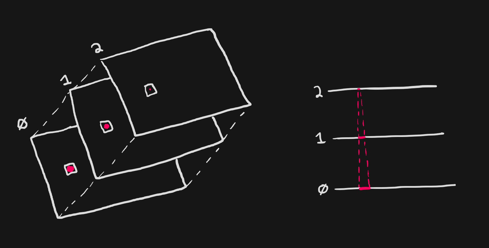
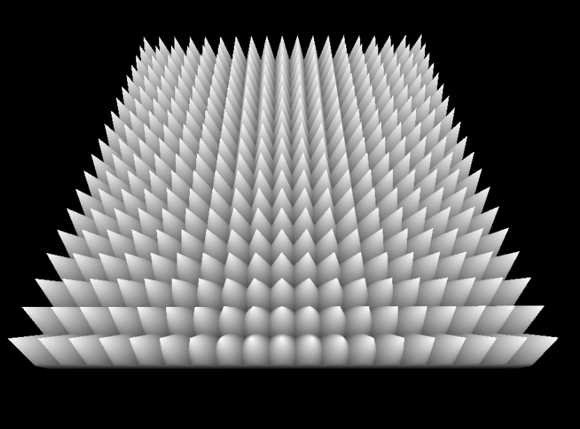

+++
title = "Shell Texturing"
date = 2023-11-10
+++

## Inspiration

[acerola](https://www.youtube.com/@Acerola_t)'s youtube video [How Are Games Rendering Fur?](https://www.youtube.com/watch?v=9dr-tRQzij4)

## How it works

<div class="center-align vmargin-1em">
  
</div>

The basic idea behind shell texturing is:

1. Render multiple mesh instances, offsetting each vertex by the normal based on the instance count and shell spacing. For example:
   ```glsl
   vec3 actualPosition = vertexPosition + normal * instanceIndex * shellSpacing
   ```
2. Output color where the current pixel is inside of the hair, otherwise discard the pixel. For example:
   ```glsl
   const float divisions = 10.0;
   vec2 localUV = fract(uv * divisions) * 2.0 - 1.0;
   float p = float(instanceIndex) / float(instanceCount)
   // compute distance to cone
   float d = length(localUV - 0.5) - (1.0 - p);

   // test if inside the cone
   if (d < 0.0) {
     gl_FragColor = vec4(1.0);
   } else {
     discard;
   }
   ```
   which ends up looking like this:
   <div class="center-align vmargin-1em">
     
   </div>

## Demo

<section id="shell-texturing-content" class="has-webgpu">
  <section class="controls">
    <div class="shellCount-control control">
      shell count <input type="range" min="16" max="512" value="64" />
      <output></output>
    </div>
    <div class="shellSpacing-control control">
      shell spacing <input type="range" min="0.001" max="1.0" value="0.004" step="0.001" />
      <output></output>
    </div>
    <div class="shellSubdivisions-control control">
      shell subdivisions <input type="range" min="2" max="1024" value="128" step="1" />
      <output></output>
    </div>
    <div class="mesh-control control">
      mesh
      <select>
        <option value="plane" selected>Plane</option>
        <option value="cube" selected>Cube</option>
        <option value="sphere">Sphere</option>
      </select>
    </div>
  </section>
  <section class="center-align">
    <canvas width="1024" height="1024"></canvas>
    <section class="center-align webgpu-missing error-border">
      
      <p class="error">
        This demo requires <a href="https://en.wikipedia.org/wiki/WebGPU">WebGPU</a> - in other words, you should open this page in Chrome or Edge.
      <p>
    </section>
  </section>
  <script src="shell-texturing.js" type="module"></script>
  <p>
    source: <a href="shell-texturing.js" target="_blank">shell-texturing.js</a>
  </p>
</section>

## Downsides

- Viewing the slices at the wrong angles cause major artifacting. This can be avoided on geometry likes planes, but complex meshes might be hard to hide the artifacts without further effort.
- Mesh UVs can cause discontinuities at the seams for programatically generated textures. One potential solve for this is using the normal and computing the UV from that, depending on the mesh this might also contain artifacts: see the `sphere` mesh above when viewed from the top.

  ```glsl
  vec3 basisUp = vec3(0.0, 1.0, 0.0);
  // swap the up vector if our normal is (0, 1, 0) - assuming y-up
  if (abs(dot(normal, basisUp)) >= 0.999) {
    basisUp = vec3f(1.0, 0.0, 0.0);
  }

  vec3 right = cross(normal, basisUp);
  vec3 up = cross(forward, right);

  vec2 uv = vec2(
    dot(right, uvw),
    dot(up, uvw),
  );
  ```

## Further Reading

- [Fur Effects - Teddies, Cats, Hair ...](https://www.xbdev.net/directx3dx/specialX/Fur/index.php)
- [An Introduction to Shell Based Fur Technique](https://gim.studio/animalia/an-introduction-to-shell-based-fur-technique/)